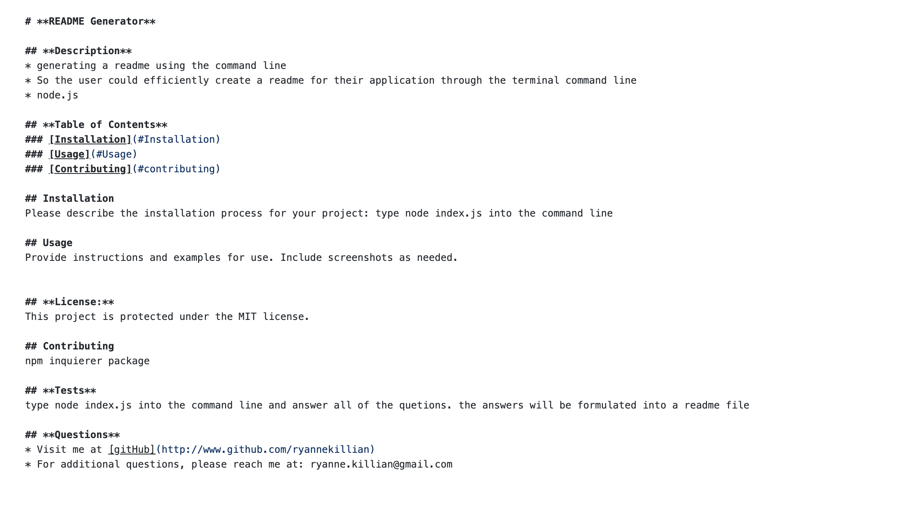

# **README Generator**

  ## **Description**
  This appliaction allows the user to generate a README using the command line.
  
  ## **Table of Contents**
  ### [Installation](#Installation)
  ### [Usage](#Usage) 
  ### [Contributing](#contributing)
    
  ## Installation
  Download the file and make sure you have the correct version of npm installed.
  
  ## Usage
  
    
  ## **License:**
  This project is protected under the MIT license.

  ## Contributing
  npm inquierer package
  
  ## **Tests**
  Type node index.js into the command line and answer all of the quetions that are prompted. The answers will be formulated into a readme file.
  
  ## **Questions**
  * Visit me at [gitHub](http://www.github.com/ryannekillian)
  * For additional questions, please reach me at: ryanne.killian@gmail.com
